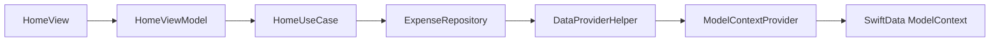
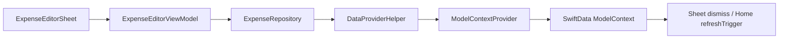
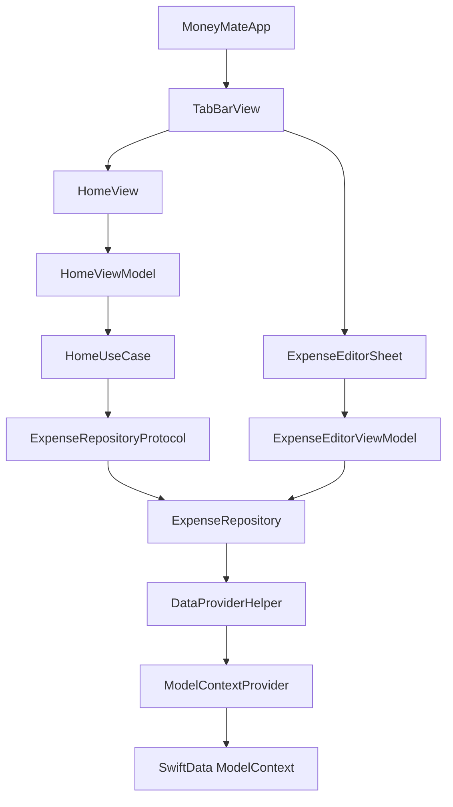
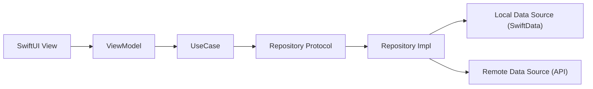

# MoneyMate Architecture Analysis

## 1. Executive Summary

目前專案以 **SwiftUI + SwiftData** 為基礎，整體屬於 **MVVM 為主、帶有混用特徵** 的架構。

- UI 層以 `View` 為主，畫面狀態由 `ObservableObject` ViewModel 管理。
- `HomeUseCase` 提供了部分 domain/use-case 抽象，但只有首頁流程使用，尚未形成完整的 Domain Layer。
- Data 層以 `ExpenseRepository` 包裝 SwiftData 存取，但仍透過全域 singleton 直接依賴 `ModelContextProvider`。
- 目前更接近 **Presentation + Data Access 的分層初稿**，尚未完全達到 Clean Architecture。

結論：  
這不是 MVC，主體偏向 MVVM；但因為 ViewModel 直接建立 Repository、Repository 直接讀取全域 context、Domain 規則散落於 ViewModel / UseCase / Model 之間，因此更準確地說是 **MVVM + Repository + Partial UseCase 的混合式架構**。

---

## 2. Current Architecture Style

### 判斷結果

**架構類型：MVVM / 混用**

### 依據

- `HomeView` 使用 `@StateObject private var homeViewModel = HomeViewModel()` 管理畫面狀態。
- `HomeViewModel` 負責載入資料、分頁、刪除後刷新、月統計等畫面邏輯。
- `ExpenseEditorSheet` 透過 `ExpenseEditorViewModel` 管理表單狀態與建立資料。
- `HomeUseCase` 負責首頁的月統計與資料查詢協調，顯示有往 Use Case 分層的方向。
- `ExpenseRepository` 負責存取 SwiftData，具備 Repository 雛形。

### 為什麼不是純 MVVM

- ViewModel 直接 `new` 具體 repository，沒有依賴注入。
- Repository 沒有透過 protocol + injector 完整隔離基礎設施。
- `Category` enum 直接持有 `Color`，Domain Model 與 UI 表現耦合。
- `ModelContextProvider` 以全域 singleton 方式注入資料上下文，屬於隱性依賴。

---

## 3. Layering Assessment

### UI Layer

主要檔案：

- `MoneyMate/Views/Home/HomeView.swift`
- `MoneyMate/Views/Home/HomeHeaderView.swift`
- `MoneyMate/Views/Home/TransactionRowView.swift`
- `MoneyMate/Views/ExpenseEditor/ExpenseEditorSheet.swift`
- `MoneyMate/Views/ExpenseEditor/CategoryEditorSheet.swift`
- `MoneyMate/Views/TabBarView.swift`

責任：

- 呈現資料
- 綁定使用者輸入
- 觸發 ViewModel action
- 控制畫面切換、sheet 顯示、toolbar 狀態

觀察：

- UI 層大多維持在合理範圍。
- `HomeView` 除了畫面組裝，也負責 `modelContextProvider.configure(context:)`，表示 UI 仍承擔 infrastructure 初始化責任。

### Domain Layer

主要檔案：

- `MoneyMate/ViewModels/Home/HomeUseCase.swift`
- `MoneyMate/Repositories/Expense/ExpenseRepositoryProtocol.swift`
- `MoneyMate/Repositories/Expense/Model/Expense.swift`

責任：

- `HomeUseCase`：首頁用例協調，包含月統計與資料讀取。
- `ExpenseRepositoryProtocol`：定義資料存取界面。
- `Expense` / `TransactionType` / `Category`：核心資料模型。

觀察：

- Domain Layer 不完整。
- `HomeUseCase` 是目前唯一明顯的 use-case 類別。
- `ExpenseEditorViewModel` 的建立邏輯沒有對應 use case，而是直接操作 repository。
- Model 與 UI 顏色耦合，代表 domain boundary 尚未乾淨。

### Data Layer

主要檔案：

- `MoneyMate/Repositories/Expense/ExpenseRepository.swift`
- `MoneyMate/Helpers/DataProviderHelper.swift`
- `MoneyMate/Helpers/ModelContextProvider.swift`

責任：

- `ExpenseRepository`：封裝 expense 的增刪查。
- `DataProviderHelper`：泛型化 SwiftData CRUD / 分頁查詢。
- `ModelContextProvider`：提供全域 `ModelContext`。

觀察：

- Data Layer 已存在，但 repository 仍依賴全域 helper 與 singleton context。
- 這使得 repository 雖然有 abstraction，但測試與替換成本仍偏高。

---

## 4. Data Flow

### 現況資料流

此專案目前沒有真正的遠端 API，資料來源是 **SwiftData 本地儲存**。  
若用題目指定的格式表示，實際流程更接近：

`SwiftData / Local Storage -> Repository -> UseCase/ViewModel -> SwiftUI View`

### Home Flow



流程說明：

1. `HomeView` 在 `.task(id: refreshTrigger)` 觸發資料載入。
2. `HomeViewModel` 呼叫 `HomeUseCase` 取得月統計與列表。
3. `HomeUseCase` 呼叫 `ExpenseRepositoryProtocol`。
4. `ExpenseRepository` 透過 `DataProviderHelper` 查詢 SwiftData。
5. 查詢結果回到 `HomeViewModel`，更新 `@Published` 狀態。
6. `HomeView` 重新 render 畫面。

### Expense Create Flow



流程說明：

1. `ExpenseEditorSheet` 綁定 `ExpenseEditorViewModel` 的表單欄位。
2. 使用者按下儲存後，`ExpenseEditorViewModel.createExpense()` 建立 `Expense`。
3. ViewModel 直接呼叫 `ExpenseRepository.addExpense`。
4. sheet 關閉後，`TabBarView` 用 `homeRefreshTrigger = UUID()` 觸發首頁重新抓資料。

### 與「API -> ViewModel -> UI」的對應

若未來接 API，可映射為：

`APIClient -> Repository -> UseCase -> ViewModel -> View`

但目前專案仍未實作 `APIClient` 或 remote data source。

---

## 5. Major Class Responsibilities

### App Entry

#### `MoneyMateApp`

- App 啟動入口。
- 註冊 SwiftData `modelContainer(for: Expense.self)`。
- 載入主畫面 `TabBarView`。

### Presentation

#### `TabBarView`

- 控制底部 tab 切換。
- 控制新增記帳 sheet 顯示。
- 在新增 sheet dismiss 後以 `UUID` 觸發首頁 refresh。

#### `HomeView`

- 首頁畫面容器。
- 綁定 `HomeViewModel`。
- 顯示 header、清單、empty state、loading state。
- 於 `onAppear` 設定 `modelContextProvider`。
- 於 `.task` 啟動首頁資料抓取。

#### `HomeHeaderView`

- 顯示月標題、收入、支出、餘額。

#### `TransactionRowView`

- 呈現單筆交易資料。
- 提供刪除 action 入口。

#### `ExpenseEditorSheet`

- 呈現新增/編輯費用表單。
- 綁定 `ExpenseEditorViewModel` 狀態。
- 送出時呼叫 `createExpense()`。

#### `CategoryEditorSheet`

- 提供 category 選擇 UI。

### ViewModel / UseCase

#### `HomeViewModel`

- 管理首頁狀態：`monthlyIncome`、`monthlyExpense`、`monthlyBalance`、`expenses`。
- 執行首頁載入流程。
- 執行分頁。
- 執行刪除後重新載入。

#### `HomeUseCase`

- 協調首頁業務流程。
- 計算每月收入、支出、餘額。
- 封裝首頁清單與刪除行為。

#### `ExpenseEditorViewModel`

- 管理新增費用表單狀態。
- 驗證輸入是否合法。
- 將畫面欄位轉成 `Expense` model。
- 直接呼叫 repository 寫入資料。

### Data

#### `ExpenseRepository`

- 封裝 `Expense` 的新增、刪除、查詢。
- 目前只是薄包裝，主要邏輯仍在 helper。

#### `DataProviderHelper`

- 提供泛型查詢、插入、刪除。
- 提供按月份查詢與分頁查詢。
- 實際扮演資料存取核心。

#### `ModelContextProvider`

- 以 singleton 方式保存 `ModelContext`。
- 供 repository/helper 間接存取 SwiftData。

#### `Expense`

- 核心資料模型。
- 同時是 SwiftData `@Model` 與 `Decodable`。
- 表示目前同一個 model 同時承擔 persistence model 與 transport/decode model 角色。

---

## 6. Dependency Map

### 實際依賴關係



### 依賴特徵

- View 依賴 ViewModel：合理。
- HomeViewModel 依賴 UseCase：合理。
- UseCase 依賴 Repository protocol：方向正確。
- ExpenseEditorViewModel 直接依賴 concrete repository：不一致。
- Repository 依賴全域 helper / singleton context：增加耦合。
- Domain enum `Category` 依賴 SwiftUI `Color`：邊界污染。

---

## 7. Risks And Potential Problems

### 1. Hidden Global Dependency

`ModelContextProvider` 需要先在 UI 層呼叫 `configure(context:)`，否則會 `fatalError`。

影響：

- 初始化順序脆弱。
- repository / helper 無法從建構子看出依賴。
- 單元測試必須額外處理 context，全域狀態也會污染測試隔離性。

### 2. Inconsistent Dependency Injection

`HomeViewModel` 經由 `HomeUseCase(repository: ExpenseRepository())` 使用 repository；  
`ExpenseEditorViewModel` 則直接 `private var repository = ExpenseRepository()`。

影響：

- 架構風格不一致。
- 不利於 mock、stub、preview 與 unit test。
- 之後若切換 remote/local data source，修改面會擴大。

### 3. Domain Logic Scattered Across Layers

目前業務規則分散在多處：

- 月統計邏輯在 `HomeUseCase`
- 輸入驗證在 `ExpenseEditorViewModel`
- amount 正負轉換在 `ExpenseEditorViewModel`
- category 顏色與 icon 在 `Category`

影響：

- 邏輯責任不清楚。
- 後續擴增編輯、搜尋、報表、同步時容易重複實作。

### 4. Repository Is Too Thin

`ExpenseRepository` 幾乎只是把呼叫轉發給 `DataProviderHelper`。

影響：

- repository abstraction 價值有限。
- 真正的查詢邏輯與基礎設施耦合點其實在 helper。
- 如果未來接 API，repository 的職責邊界仍需重整。

### 5. Model Coupled To UI

`Category` enum 直接回傳 `Color` 與 `systemImageName`。

影響：

- Domain model 帶入 SwiftUI。
- model 難以重用到其他層，例如 widget、server DTO、純 domain test。
- 若設計系統重構，domain code 也會被迫修改。

### 6. Testability Gaps

測試目錄已有 mock repository 與 unit test 雛形，但目前測試碼與實作存在不一致跡象：

- `MoneyMateTests.swift` 呼叫 `viewModel.insertMockExpenses()`，但目前 `ExpenseEditorViewModel` 中未看到此方法。
- 測試建立了 in-memory `ModelContext`，但未看到 `modelContextProvider.configure(context:)`。
- `fetchThisMonth` 是 async，但測試使用方式像同步呼叫。

影響：

- 表示測試可能已過時或尚未完成。
- 目前架構的可測試性仍不足。

### 7. HomeView Contains Startup Wiring

`HomeView` 同時負責 UI 呈現與 `modelContextProvider.configure(context:)`。

影響：

- 畫面層承擔 App composition 責任。
- 導致初始化與顯示耦合。

### 8. Potential Massive ViewModel Trend

目前 `HomeViewModel` 還不算 massive，但它已開始承擔：

- summary loading
- list loading
- pagination
- delete
- refresh coordination
- UI format string

若功能增加，很容易演變成 massive ViewModel。

---

## 8. Improvement Recommendations

### 建議方向一：補齊 MVVM 邊界

優先建議先把現有架構整理成一致的 MVVM，而不是一次大改。

建議：

- 所有 ViewModel 都改成 constructor injection。
- `HomeViewModel` / `ExpenseEditorViewModel` 都依賴 use case 或 protocol，而不是直接建 concrete repository。
- 將 `ModelContext` 從 app composition root 注入到 repository / data source。

目標範例：

```swift
HomeViewModel(
    fetchMonthlySummaryUseCase: ...,
    fetchExpensesUseCase: ...,
    deleteExpenseUseCase: ...
)
```

### 建議方向二：朝 Clean Architecture 漸進演進

可以將專案分成以下層級：

#### Presentation

- SwiftUI Views
- ViewModels
- UI-specific formatter / presentation model

#### Domain

- Entities
- UseCases
- Repository Protocols
- Validation Rules

#### Data

- Repository Implementations
- SwiftData Local Data Source
- API Client / Remote Data Source（未來若接後端）
- DTO / Mapper

### 建議方向三：抽出 Local Data Source

目前 `ExpenseRepository` 直接依賴 `DataProviderHelper`。  
可改成：

`ExpenseRepository -> ExpenseLocalDataSource -> SwiftData`

這樣有幾個好處：

- repository 可以專注在資料來源整合與 mapping。
- local data source 專心處理 SwiftData 細節。
- 未來接 API 時更容易擴充 `RemoteDataSource`。

### 建議方向四：移除全域 singleton context

建議不要讓 `ModelContextProvider.shared` 成為必要依賴。

較佳做法：

- 在 app 啟動時建立 container / context。
- 經由 dependency injection 傳入 repository 或 local data source。
- 減少 `fatalError` 型依賴。

### 建議方向五：拆分 Use Cases

目前 `HomeUseCase` 同時處理多種責任。  
可逐步拆成：

- `FetchMonthlySummaryUseCase`
- `FetchExpenseListUseCase`
- `DeleteExpenseUseCase`
- `CreateExpenseUseCase`

好處：

- 單一責任更清楚。
- 容易測試。
- ViewModel 不會持續膨脹。

### 建議方向六：分離 Domain Model 與 UI Metadata

把 `Category.color`、`Category.systemImageName` 從 domain enum 搬到 presentation mapping。

例如：

- `CategoryPresentationMapper`
- `CategoryDisplayModel`

好處：

- domain 不依賴 SwiftUI。
- 設計系統調整不會污染 domain。

### 建議方向七：整理測試策略

建議建立以下測試層次：

- ViewModel tests：驗證 state transition、輸入驗證、error handling
- UseCase tests：驗證月統計、刪除、建立流程
- Repository tests：驗證 SwiftData query 與 mapping
- UI tests：驗證新增、刪除、刷新主流程

並修正現有測試與實作不一致問題。

---

## 9. Suggested Target Architecture

### 短期目標

維持 SwiftUI + SwiftData，不做大規模重寫，先調整為：

`View -> ViewModel -> UseCase -> RepositoryProtocol -> Repository -> LocalDataSource -> SwiftData`

### 中期目標

若未來加入網路同步或多資料來源，可演進為：

`View -> ViewModel -> UseCase -> RepositoryProtocol -> Repository -> LocalDataSource / RemoteDataSource`

### 目標示意圖



---

## 10. Final Assessment

### 現況評價

這個專案已具備不錯的分層雛形：

- 有 View / ViewModel / Repository 的基本切分
- 有 protocol abstraction 的意識
- 有 UseCase 的初步導入

但目前仍處於 **從小型 SwiftUI App 向可維護架構演進的中間階段**。

### 主要問題總結

- 依賴注入不一致
- 全域 singleton context 帶來隱性耦合
- Domain layer 不完整
- Model 與 UI metadata 耦合
- 測試策略與實作尚未對齊

### 建議結論

最實際的改善方向不是全面重寫，而是：

1. 先把所有資料存取改為 constructor injection。
2. 把 `ExpenseEditorViewModel` 補上 use case。
3. 將 SwiftData 細節下沉到 local data source。
4. 將 `Category` 的 UI 表現資訊移出 domain。
5. 補齊 use case / view model 單元測試。

完成以上步驟後，專案就能從「混合式 MVVM」穩定過渡到較乾淨的 **MVVM + Clean Architecture**。
